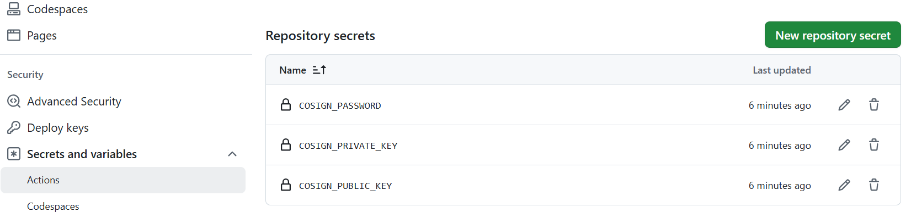

# Software Supply Chain Security Implementation Using Cosign (Internship Report)

| Field               | Details                                                        |
|---------------------|----------------------------------------------------------------|
| Name                | Saba Altaf                                                     |
| Degree Programme    | Bachelor in Business Information Technology (Cyber Security)   |
| University          | [Laurea University of Applied Sciences](https://www.laurea.fi) |
| Student ID          | 2108175                                                        |
| Internship Company  | [PnE Technology](https://pnetechnology.com/), Lahore, Pakistan |
| Internship Interval | 9/12/2024 - 15/5/2025                                          |

## Introduction

The increasing prevalence of software supply chain attacks has emphasized the importance of securing the integrity and authenticity of software artifacts. During my internship at PnE Technologies, my primary objective was to investigate, select, and implement a robust software supply chain security solution. This report documents my work on evaluating existing tools and implementing Cosign to sign, verify, and attest software artifacts produced by PnE Technology. I would like to thank you Mr. Muhammad Waqas and Mr. Hassan Younus for their continued support and guidance during the internship. Overall, the intership was a very good learning experience for me and I enjoyed working being part of the team. 

## Objectives

The key objectives of the internship were:

- To explore existing solutions for software supply chain security.
- To evaluate and select a suitable tool based on the needs of PnE Technologies.
- To implement the selected solution and apply it to PnE software products.
- To ensure that all software delivered by the company can be verified for integrity, authenticity, and tamper-resistance

## Research and Tool Evaluation

I began by researching existing software supply chain security solutions, focusing on open-source and industry-standard tools. The tools evaluated included:

- Cosign (by Sigstore)
- Notary v2
- In-toto
- TUF (The Update Framework)

After comparing features, community support, ease of use, and integration capabilities, Cosign was selected for the following reasons:

- Active development and community support
- Simple CLI-based interface
- Supports container image signing, key based signing and keyless signing via OpenID Connect (OIDC), and attestations
- Seamless integration with CI/CD pipelines.

## Tool Overview: Cosign

### Introduction

Cosign supports software artifact signing, verification, and storage in an OCI (Open Container Initiative) registry. While Cosign was developed with containers and container-related artifacts in mind, it can also be used to sign blobs (binary large objects), files like READMEs, SBOMs (software bills of materials), Kubernetes Helm Charts, and more.
By signing software, you can authenticate that you are who you say you are, which can in turn enable a trust root so that developers and consumers who leverage your software can verify that you created the software artifact that you have said you have created. They can also ensure that the artifact was not tampered with by a third party. As someone who may use software libraries, containers, or other artifacts as part of your development lifecycle, a signed artifact can give you greater assurance that the code or container you are incorporating is from a trusted source.

### Cosign Components

1. **Cosign**: The CLI utility to perform signing.
2. **Fulcio**: A root certificate authority based on an OpenID Connect email address for code signing with  X.509 certificates valid for 10 minutes under Sigstore.
3. **Rekor**: A transparency logger that stores records of artifacts metadata providing transparency for signatures by allowing users of the software to query the logs to see if the signature is valid and signed by the authorized software owners.

As such this report's primary focus is the CLI utility Cosign. The other two are briefly mentioned but a detailed treatment of them is beyond the scope of this document.

### Codesigning with Cosign

Similar in concept to a signature on a document that was signed in the presence of a notary or other professional who can certify your identity, a signature on a software artifact attests that you are who you say you are and that the code was not altered after signing. Instead of a recognized notary when you sign software, it is a recognized certificate authority (CA) that validates your identity. These checks that go through recognized bodies able to establish a developer's identity support the root of trust that security relies on so that bad actors cannot compromise software.
Code signing involves a developer, software publisher, or entity (like an automated workload) digitally signing a software artifact to confirm their identity and ensure that the artifact was not tampered with since having been signed. Code signing has several implementations, and Cosign is one such implementation, but all code signing technology follows a similar process as Cosign.
Cosign supports two types of signing namely: `Keyless signing` and `Keybased signing`.

#### Keyless Signing

Keyless signing works by verifying the signer's identity by using identity ptroviders like Google, Email and Github and it puts the signer's identity into the artifact signing certificate. When the signing is done, the signing certificate is thrown away after 10 minutes and the only metadata from the whole act is the public key stored inside the Rekor tlog.
`Keyless signing` is the recommended practice for a developer or organization looking to sign their code with Cosign.
This process will first generate an ephemeral key pair which will then be used to create a digital signature for a given software artifact. A key pair is a combination of a signing key to sign data, and a verification key that is used to verify data signed with the corresponding signing key. With the `cosign sign` command, the developer will sign their software artifact, and that signature will be stored in the registry (if applicable). This signature can later be verified by others through searching for an artifact, finding its signature, and then verifying it.

#### Key Based Signing

It is also possible to use Cosign with long-lived key pairs. This will be discussed in detail later on in this report.

### Cosign Installation

Cosign is available for Linux and MacOS. My Operating System was Windows 11 so I used Windows Subsystem for Linux (WSL2) to install Alma Linux and consequently installed Cosign on it. There are multiple ways to install Cosign. I installed Cosign with the Cosign binary package as is shown in the code below. For other installation procedures please refer to Cosign [install](https://edu.chainguard.dev/open-source/sigstore/cosign/how-to-install-cosign/) page.

```bash
$ wget "https://github.com/sigstore/cosign/releases/download/v2.4.1/cosign-linux-amd64"
$ sudo mv cosign-linux-amd64 /usr/local/bin/cosign
$ sudo chmod +x /usr/local/bin/cosign
```

### Signing Blobs and Files

As of now, I will sign the software binary artifact manually, however, later on, I will put everything together and implement both the keyless and key-based signing as part of a github CI/CD pipeline.

I will first sign the blobs and files with keyless signing mechanism and then with key based mechanism.

#### Keyless Signing and Verification

Below, I created a random binary file with size `1024` bytes and signed the resultant file with keyless signing technique.

```bash
$ head -c 1024 /dev/urandom > random-binary-file.bin
$ cosign sign-blob --output-signature random-binary-file.sig random-binary-file.bin
Using payload from: random-binary-file.bin
Generating ephemeral keys...
Retrieving signed certificate...

        The sigstore service, hosted by sigstore a Series of LF Projects, LLC, is provided pursuant to the Hosted Project Tools Terms of Use, available at https://lfprojects.org/policies/hosted-project-tools-terms-of-use/.
        Note that if your submission includes personal data associated with this signed artifact, it will be part of an immutable record.
        This may include the email address associated with the account with which you authenticate your contractual Agreement.
        This information will be used for signing this artifact and will be stored in public transparency logs and cannot be removed later, and is subject to the Immutable Record notice at https://lfprojects.org/policies/hosted-project-tools-immutable-records/.

By typing 'y', you attest that (1) you are not submitting the personal data of any other person; and (2) you understand and agree to the statement and the Agreement terms at the URLs listed above.
Are you sure you would like to continue? [y/N]
...
```

At this point, a browser window opened and I was directed to a page that asked me to log in to Sigstore. It is possible to authenticate with GitHub, Google, or Microsoft. I authenticated with my GitHub credentials. It is important to note that the email address that is tied to these credentials will be permanently visible in the Rekor transparency log. Once I logged in and authenticated, I received the feedback of "Sigstore Authentication Successful!", and I may now safely close the window.

On the terminal, I received the message that I was successfully verified, and I got confirmation that the signature was pushed.

```bash
Successfully verified SCT...
using ephemeral certificate:
-----BEGIN CERTIFICATE-----
MIICzzCCAlWgAwIBAgIUGtDkuS0Ca047ztSBKwJKmFTnZo8wCgYIKoZIzj0EAwMw
NzEVMBMGA1UEChMMc2lnc3RvcmUuZGV2MR4wHAYDVQQDExVzaWdzdG9yZS1pbnRl
cm1lZGlhdGUwHhcNMjUwNTI1MjIzMzE1WhcNMjUwNTI1MjI0MzE1WjAAMFkwEwYH
KoZIzj0CAQYIKoZIzj0DAQcDQgAEJWBJNvX6V3LCeFXY+AssDTSAc9FsvO0pY57F
lW+wV4uH2XR+ZHmB0v/j+zPplDKWq/2MJbXy0SNM1AJl79rTjqOCAXQwggFwMA4G
A1UdDwEB/wQEAwIHgDATBgNVHSUEDDAKBggrBgEFBQcDAzAdBgNVHQ4EFgQU6RWX
ANF04PqolVwISl2uO+cdmxgwHwYDVR0jBBgwFoAU39Ppz1YkEZb5qNjpKFWixi4Y
ZD8wHwYDVR0RAQH/BBUwE4ERc2FiYWhzYW5AbGl2ZS5jb20wLAYKKwYBBAGDvzAB
AQQeaHR0cHM6Ly9naXRodWIuY29tL2xvZ2luL29hdXRoMC4GCisGAQQBg78wAQgE
IAweaHR0cHM6Ly9naXRodWIuY29tL2xvZ2luL29hdXRoMIGJBgorBgEEAdZ5AgQC
BHsEeQB3AHUA3T0wasbHETJjGR4cmWc3AqJKXrjePK3/h4pygC8p7o4AAAGXCZQt
oAAABAMARjBEAiAajOVW1nG2MgKRG8OSyW4L0F9vQsp/v+xo8E+3nHC9rQIgdyJ5
hWrYluwEi9fJIXiDy06xuiJHhInPyBYzqzaOLnQwCgYIKoZIzj0EAwMDaAAwZQIw
Ptas2BsAybVzlnYWlWgwBnVBp76ZBG4av1DEb6thorUt2G7jTnjXZNbD4JkSUX65
AjEAv3bB0X/ZUeBAbBq+X2NCACt9MlQgIDT0tcjGUZ3HvqgIP4sB7MH9fiWLwIhO
dIQs
-----END CERTIFICATE-----

tlog entry created with index: 219865782
Wrote signature to file random-binary-file.sig
```

The above output indicates the successful creation of signature file for the random binary object and a corresponding transparency log entry.

Now, I will show how can one verify the signatures of the binary to ensure that it is an authentic binary file.

```bash
 $ cosign verify-blob --signature random-binary-file.sig --certificate random-binary-file-certificate.cert --certificate-identity <my-email-used-with-Github> --certificate-oidc-issuer-regexp "https://github.com/login/oauth" random-binary-file.bin
 Verified OK
 ```
 
 The above command is used to verify the blob and the response `Verified OK` indicates a successful verification.
 
#### Key-based Signing and Verification

Cosign supports software signing with long-lived key pairs. The first step for this kind of signing is to generate a key pair.

```bash
$ cosign generate-key-pair
Enter password for private key:
Enter password for private key again:
Private key written to cosign.key
Public key written to cosign.pub
```

The above command generates a public/private key pair with `cosign.key` as private and `cosign.pub` as public key. The generated key pair is an `ECDSA-P256` based key pair. The public key bytes are encoded in a PKIX formatted file. The private key is transformed into PKCS8 formatted bytes which are then encrypted using `nacl/secretbox` and passphrase using `scrypt` for the KDF, and written to disk in a PEM (may not have an extension of `pem` but `key`) file with the header: `BEGIN ENCRYPTED SIGSTORE PRIVATE KEY`.

Once the key pair is generated, it is possible to sign a blob with this key pair. Following command signs a blob with the key pair (signing requires private key only) generated above and creates a signature for random-binary-file.

```bash
$ cosign sign-blob --key cosign.key random-binary-file.bin --output-signature random-binary-file-keybased.sign
Using payload from: random-binary-file.bin
Enter password for private key:

        The sigstore service, hosted by sigstore a Series of LF Projects, LLC, is provided pursuant to the Hosted Project Tools Terms of Use, available at https://lfprojects.org/policies/hosted-project-tools-terms-of-use/.
        Note that if your submission includes personal data associated with this signed artifact, it will be part of an immutable record.
        This may include the email address associated with the account with which you authenticate your contractual Agreement.
        This information will be used for signing this artifact and will be stored in public transparency logs and cannot be removed later, and is subject to the Immutable Record notice at https://lfprojects.org/policies/hosted-project-tools-immutable-records/.

By typing 'y', you attest that (1) you are not submitting the personal data of any other person; and (2) you understand and agree to the statement and the Agreement terms at the URLs listed above.
Are you sure you would like to continue? [y/N] y
tlog entry created with index: 220941086
Wrote signature to file random-binary-file-keybased.sign
```

Signature verification process is similar to keyless based signature verification, however, in this case, there is a need to use the public key genrated during key pair generation.

```bash
$ cosign verify-blob --key cosign.pub --signature random-binary-file-key.sig random-binary-file.bin
Verified OK
```

The above output indicates successful verification of the corresponding file.

### Implementation of Keyless and Key-based Verification in Github Pipeline

PnE Technology have a Github based CI/CD pipeline to automatically generate the binary artificats. My final internship task was to implement both the keyless and key-based signing and verification of binary artifacts generated at the end of a successful CI/CD pipeline run. As such, the pipeline generated the binary artifacts and those artifacts needed to be signed and later on verified. Due to sensitivity of the artifacts, it is not possible to show the signing and verification of actual artifacts rather I will show the signing and verification procedure with sample binary files.

At this point, I had all the necessary knowledge to incorporate the signing and verification of binary artifacts in the pipeline. I have setup a  reference Github [demo project](https://github.com/sabahsan/cosigndemo) for the internship report and implementation of the above in a Github CI/CD pipeline with code explanation. For key based signing and verification, there is a need to have certain CI/CD variables defined beforehand. Below command is used to define these variables.

```bash
$ cosign generate-key-pair github://sabahsan/cosigndemo
Enter password for private key:
Enter password for private key again:
Password written to COSIGN_PASSWORD github actions secret
Private key written to COSIGN_PRIVATE_KEY github actions secret
Public key written to COSIGN_PUBLIC_KEY github actions secret
Public key also written to cosign.pub
```

The above command generates the `COSIGN_PASSWORD`, `COSIGN_PRIVATE_KEY`, and `COSIGN_PUBLIC_KEY` Github secrets and makes them automatically available in the CI/CD pipeline for the `cosigndemo` project in Github. A graphical depiction is shown below:

<div style="text-align: center;">

<p>Figure 1: CI/CD variables for key-based cosign implementation</p>
</div>

With these secrets available, I wrote the pipeline to sign the binary with private key and generate a signature file and verify the signed binary with given signature file by using the corresponding public key.

Pasted below is the pipeline code for signing and verification with private/public key pair. A brief explanation of various important aspects of the pipeline will follow the code.

```yaml

name: cosigndemo-ci.yml

on:
  push:
    branches:
      - main
  workflow_dispatch:

jobs:
  install-and-sign:
    runs-on: ubuntu-latest
    steps:
      - name: Checkout code
        uses: actions/checkout@v4

      - name: Install cosign
        uses: sigstore/cosign-installer@v3.5.0
        with:
          cosign-release: 'v2.4.1'

      - name: Sign blob
        env:
          COSIGN_PASSWORD: "${{ secrets.COSIGN_PASSWORD }}"
        run: |
          echo "${{ secrets.COSIGN_PRIVATE_KEY }}" > cosign.key
          chmod 600 cosign.key
          cosign sign-blob \
            --tlog-upload=false \
            --key cosign.key \
            --output-signature random-binary-file.sig \
            random-binary-file.bin

      - name: Upload binary and signature
        uses: actions/upload-artifact@v4
        with:
          name: cosign-artifacts
          path: |
            random-binary-file.bin
            random-binary-file.sig

  verify-signed-blob:
    runs-on: ubuntu-latest
    needs: install-and-sign
    steps:
      - name: Install cosign
        uses: sigstore/cosign-installer@v3.5.0
        with:
          cosign-release: 'v2.4.1'

      - name: Download artifacts
        uses: actions/download-artifact@v4
        with:
          name: cosign-artifacts
          path: ./artifacts

      - name: Verify blob
        run: |
          echo "${{ secrets.COSIGN_PUBLIC_KEY }}" > cosign.pub
          cosign verify-blob \
            --insecure-ignore-tlog=true \
            --key cosign.pub \
            --signature ./artifacts/random-binary-file.sig \
            ./artifacts/random-binary-file.bin
          if [ $? -ne 0 ]; then
            printf "Blob verification failed with exit code: %d\n" $?
            exit 1
          fi
          echo "Blob verification successful"
```

The above pipeline consists of two jobs, `install-and-sign` and `verify-signed-blob`. There are four steps in the first job. These are:

1. Checkout code: Checks out repository code by using Github action `checkout@v4`
2. Install cosign: Install the required version of Cosign by using Github action `cosign-installer@v3.5.0`
3. Sign blob: Signs the `random-binary-file.bin` with the `COSIGN_PRIVATE_KEY`
4. Upload binary and signature: Uploads both the binary and the signature file by using Github ation `upload-artifacts@v4`.

A transparency log is a public, append-only log that records all signed artifacts. It provides a way to ensure the integrity and authenticity of the signed data by allowing anyone to verify that a particular signature exists in the log. In the `Sign blob` step, I am using a new option `--tlog-upload=false`. By setting this option to `false`, I am instruting Cosign not to upload the signature to the transparency log as during my intership it was not desired to publicly disclose the signature.

Similar to the first job, the second job has three steps. The first step is same as the first step in the first job i.e. `Install cosign`. In the second step, I am downloading the artifacts saved by the first job and in the final step, I am verifying the blob with a given signature file. In this step, I am using a new option `--insecure-ignore-tlog=true`. This option is needed and works in tandem with the option `--tlog-upload=false` as it allows Cosign utility to bypass the verification of signatures against a transparency log when verifying the artifacts.

As a last step, I have added support for keyless signing in the pipeline. Pasted below is the code for performing keyless blob signing and verification.Brief explanation of the pipeline code is provided after the code.

```yaml
  keyless-sign-blob:
    runs-on: ubuntu-latest
    needs: verify-signed-blob
    permissions:
      id-token: write # needed for keyless signing
      contents: read
    steps:
      - name: Checkout code
        uses: actions/checkout@v4

      - name: Install cosign
        uses: sigstore/cosign-installer@v3.5.0
        with:
          cosign-release: 'v2.4.1'

      - name: Keyless sign blob
        run: |
          cosign sign-blob \
            --yes \
            --output-signature keyless-random-binary-file.sig \
            --output-certificate krbf-cert.pem \
            keyless-random-binary-file.bin

      - name: Upload binary and signature
        uses: actions/upload-artifact@v4
        with:
          name: keyless-cosign-artifacts
          path: |
            keyless-random-binary-file.bin
            keyless-random-binary-file.sig
            krbf-cert.pem

  keyless-verify-signed-blob:
    runs-on: ubuntu-latest
    needs: keyless-sign-blob
    steps:
      - name: Install cosign
        uses: sigstore/cosign-installer@v3.5.0
        with:
          cosign-release: 'v2.4.1'

      - name: Download artifacts
        uses: actions/download-artifact@v4
        with:
          name: keyless-cosign-artifacts
          path: ./artifacts

      - name: Set certificate identity
        run: echo "CERT_ID=https://github.com/${{ github.repository }}/.github/workflows/cosigndemo-ci.yml@${{ github.ref }}" >> $GITHUB_ENV

      - name: Keyless verify blob
        run: |
          cosign verify-blob \
            --cert ./artifacts/krbf-cert.pem \
            --certificate-identity "$CERT_ID" \
            --certificate-oidc-issuer "https://token.actions.githubusercontent.com" \
            --signature ./artifacts/keyless-random-binary-file.sig \
            ./artifacts/keyless-random-binary-file.bin
          if [ $? -ne 0 ]; then
            printf "Keyless blob verification failed with exit code: %d\n" $?
            exit 1
          fi
          echo "Keyless blob verification successful"

```

The above code describes two pipeline jobs `keyless-sign-blob` and `keyless-verify-signed-blob`. Most of the steps in these two jobs are similar to the steps in `key-based` jobs, however, the actual signing and verification commands are slightly different. During keyless siging, the artifacts contain an additional certificate file `krbf-cert.pem`. The certificate file is used in verifying the keyless based signatures. The verification command requires `certificate-identity` and `certificate-oidc-issuer` values. The latter is quite straight-forward as the OIDC issuer is always Github, the hard coded value of `https://token.actions.githubusercontent.com` should always work. The former value is dynamically generated as it may change depending on the context e.g. branch context or merge request etc. The variable `github.repository` refers to `OWNER/REPOSITORY` (sabahsan/cosigndemo) and the variable `github.ref`may refer to `refs/heads/BRANCH` (refs/heads/main) etc.

## Conclusion

This internship provided me a valuable hands-on experience in the field of software supply chain security. I learned to establish artifacts integrity by using Cosign tool for both key-based and keyless blob signing and verification. The work enhanced my understanding of cryptographic trust models for CI/CD integration.

## References

1. [PnE Technology](https://pnetechnology.com/)
2. [Cosign](https://github.com/sigstore/cosign)
3. [Github Guide to CI/CD](https://github.blog/developer-skills/github/a-beginners-guide-to-ci-cd-and-automation-on-github/)

